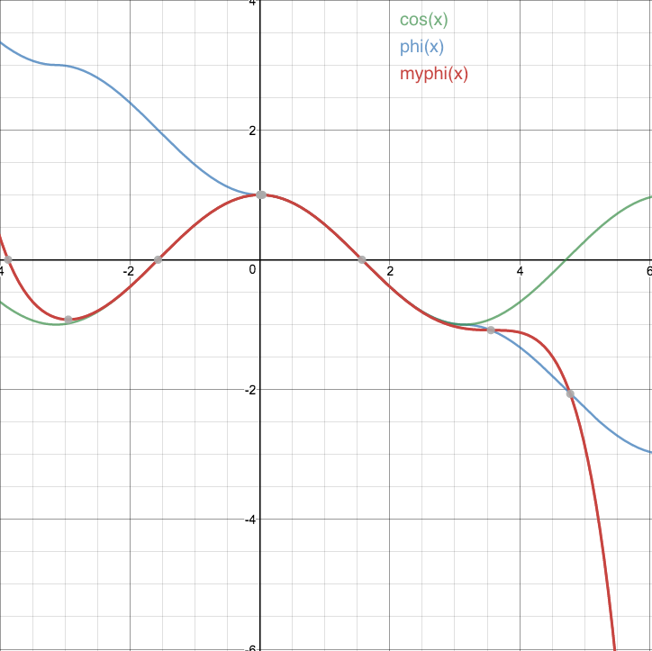

# SphereFace
A PyTorch Implementation of SphereFace.
The code can be trained on CASIA-Webface and the best accuracy on LFW is **99.22%**.

[SphereFace: Deep Hypersphere Embedding for Face Recognition](https://arxiv.org/abs/1704.08063)

# Train
```
python train.py
```

# Test
```
# lfw.tgz to lfw.zip
tar zxf lfw.tgz; cd lfw; zip -r ../lfw.zip *; cd ..

# lfw evaluation
python lfw_eval.py --model model/sphere20a_20171020.pth
```

# Pre-trained models
| Model name      | LFW accuracy | Training dataset |
|-----------------|--------------|------------------|
| [20171020](model/sphere20a_20171020.7z) | 0.9922 | CASIA-WebFace |

# φ


=1-\frac{x^2}{2!}+\frac{x^4}{4!}-\frac{x^6}{6!}+\frac{x^8}{8!}-\frac{x^9}{9!})



# References
[sphereface](https://github.com/wy1iu/sphereface)